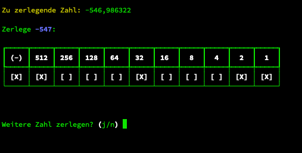

# Zahlenzerleger

Zerlegt eine Zahl in ihre binären Potenzen.

Matheunterricht Lena, 8. Klasse:
Die Schüler erhalten automatisch generierte Aufgabenblätter und müssen die Ergebnisse abgeben,
indem sie das Ergebnis in die binären Faktoren zerlegen und die enthaltenen Faktoren ankreuzen.

Da der Vorgang als solches a) zeitaufwändig ist und b) eine weitere, unnötige Fehlerquelle darstellt,
übernimmt dieses Skript die Zerlegung und stellt das Ergebnis so dar, wie es anzukreuzen ist.

